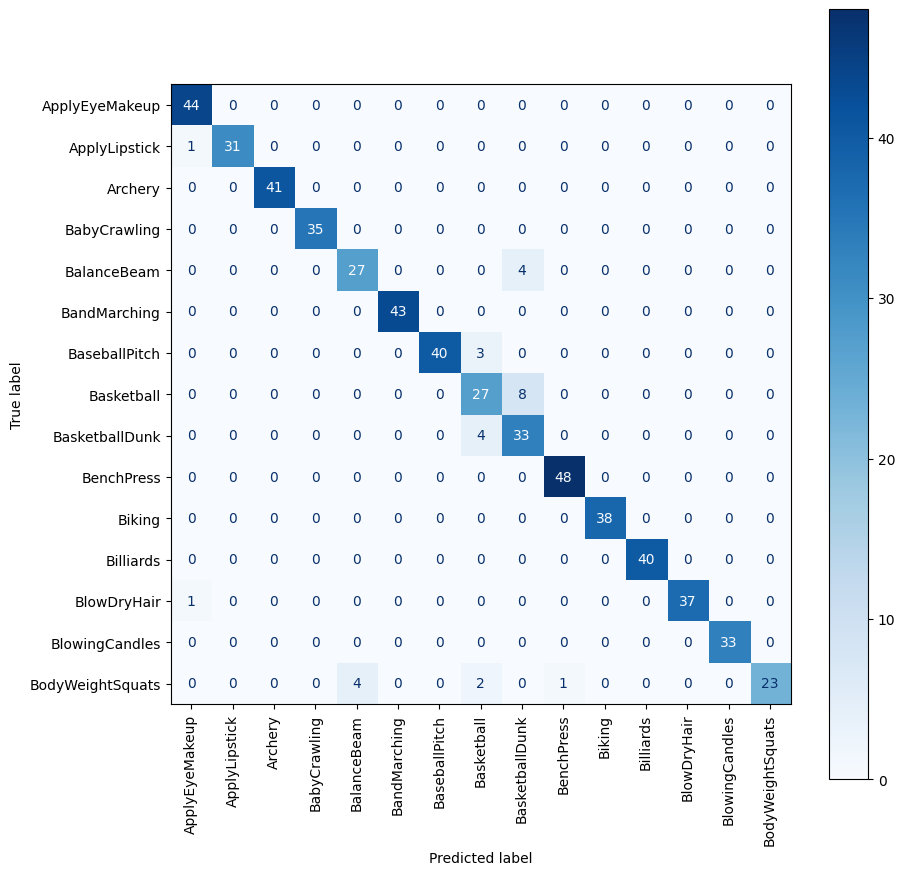
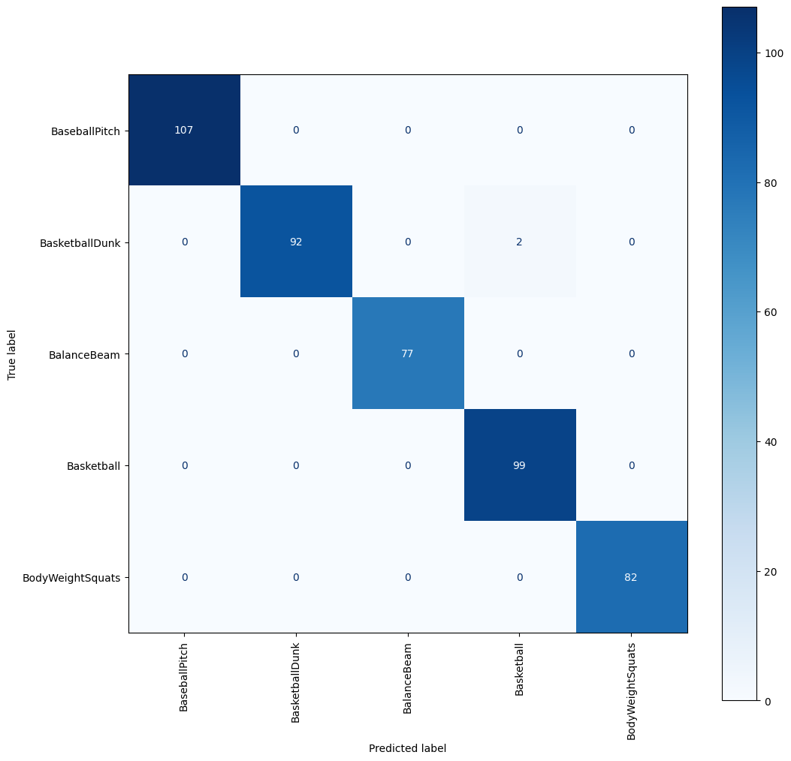
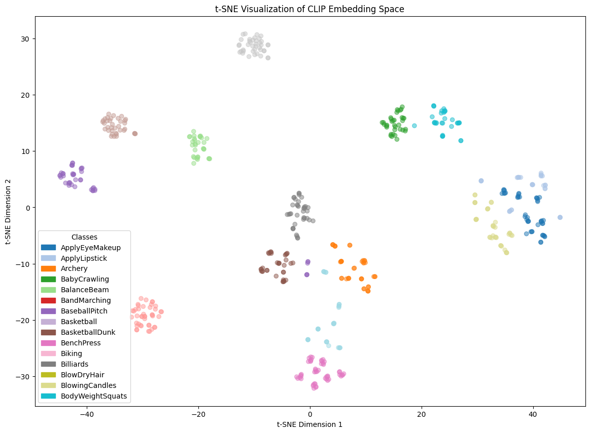
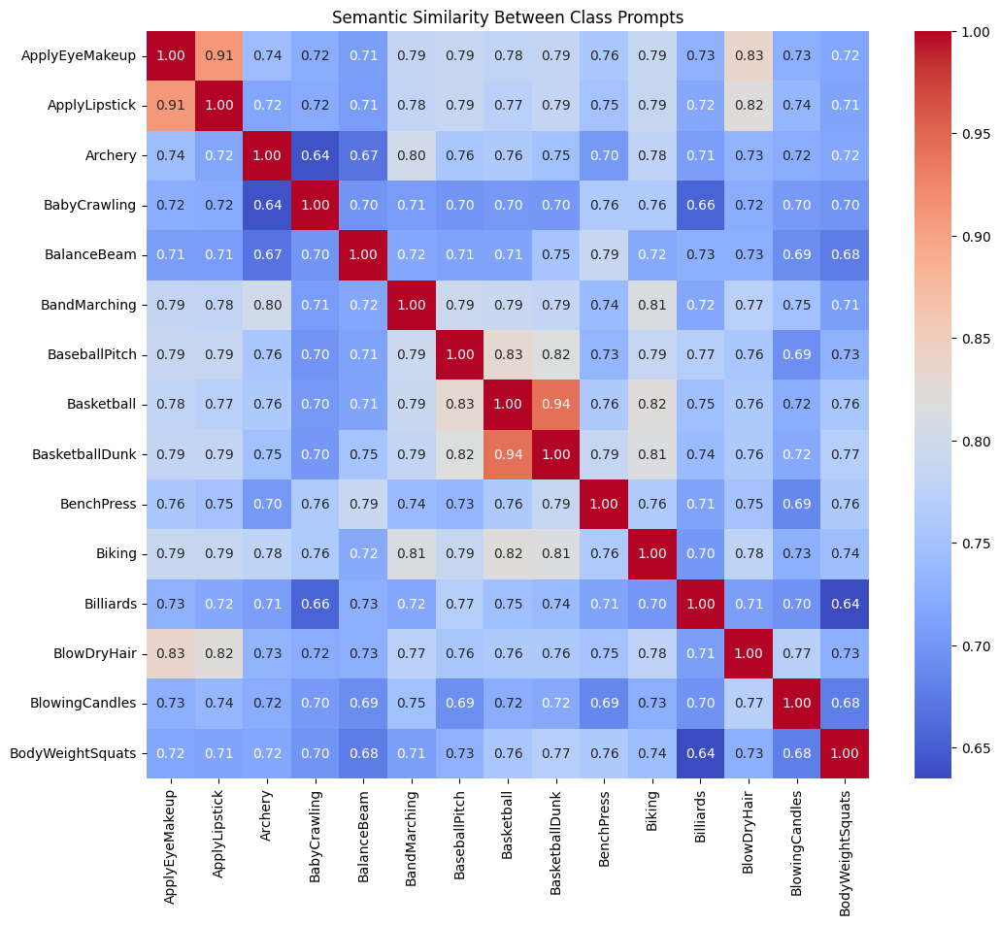
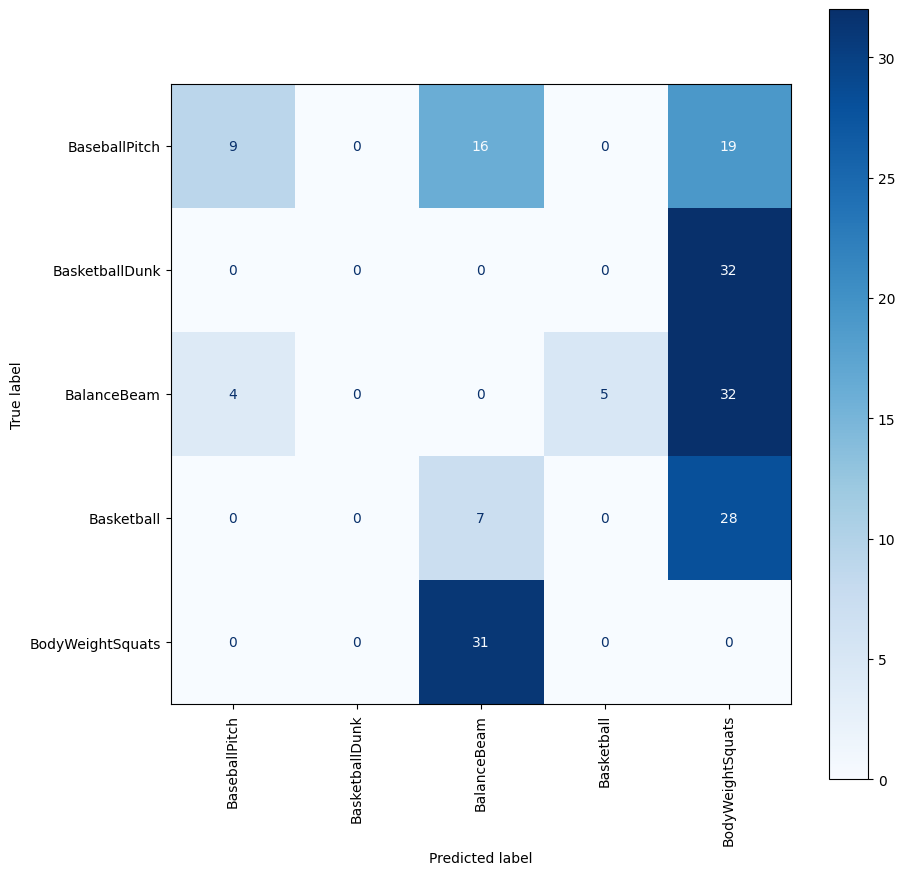

# Action Recognition Final Report

## i. Model Used

The primary model used for this project was **OpenAI's CLIP (Contrastive Language-Image Pre-Training)**, specifically the `ViT-B/32` variant.

This pre-trained Vision-Language Model (VLM) was chosen for its powerful zero-shot capabilities. It understands both images and text in a shared embedding space, allowing it to classify videos based on natural language prompts without requiring direct training on the specific action classes.

-----

## ii. Experimental Setup

The experiment was conducted on a subset of **15 classes** ` ['ApplyEyeMakeup', 'ApplyLipstick', 'Archery', 'BabyCrawling', 'BalanceBeam', 'BandMarching', 'BaseballPitch', 'Basketball', 'BasketballDunk', 'BenchPress', 'Biking', 'Billiards', 'BlowDryHair', 'BlowingCandles', 'BodyWeightSquats']` from the **UCF101 dataset**, utilizing the official train/test splits for evaluation.

1.  **Zero-Shot Evaluation**: The core task involved evaluating the pre-trained CLIP model's ability to classify actions. This was done by creating text prompts for each class (e.g., *"a photo of a person Archery"*) and matching them against video representations using cosine similarity.
2.  **Temporal Input Comparison**: To assess the importance of motion, two methods were compared:
      * **Single Frame**: Using only the middle frame to represent the video.
      * **Short Clip**: Extracting a 3-second clip from the center of the video and averaging the features from 8 frames within that clip.
3.  **Few-Shot Fine-Tuning**: A targeted fine-tuning experiment was conducted on the 5 classes with the lowest initial accuracy. To prevent catastrophic forgetting, the CLIP model's vision backbone was **frozen**, and only the final linear projection layer was trained.

-----

## iii. Accuracy and Example Outputs

The model demonstrated strong performance in the zero-shot evaluation on the test set.

### Overall Performance

The model achieved a **Top-1 Accuracy of 95.07%**.

### Confusion Matrix


*The confusion matrix above visually confirms the high accuracy, with a strong diagonal indicating most classes were predicted correctly. It also highlights specific areas of confusion, such as the model sometimes misclassifying `Basketball` as `BasketballDunk`.*

### Classification Report

The detailed classification report provides per-class metrics for precision, recall, and f1-score.

```
                   precision    recall  f1-score   support

   ApplyEyeMakeup       0.96      1.00      0.98        44
    ApplyLipstick       1.00      0.97      0.98        32
          Archery       1.00      1.00      1.00        41
     BabyCrawling       1.00      1.00      1.00        35
      BalanceBeam       0.87      0.87      0.87        31
     BandMarching       1.00      1.00      1.00        43
    BaseballPitch       1.00      0.93      0.96        43
       Basketball       0.75      0.77      0.76        35
   BasketballDunk       0.73      0.89      0.80        37
       BenchPress       0.98      1.00      0.99        48
           Biking       1.00      1.00      1.00        38
        Billiards       1.00      1.00      1.00        40
      BlowDryHair       1.00      0.97      0.99        38
   BlowingCandles       1.00      1.00      1.00        33
 BodyWeightSquats       1.00      0.77      0.87        30

         accuracy                           0.95       568
        macro avg       0.95      0.94      0.95       568
     weighted avg       0.96      0.95      0.95       568
```
This report quantifies the high performance. Most classes achieve an **F1-score of 0.95 or higher**, with many reaching a perfect 1.00. It numerically confirms the confusion seen in the matrix, with `Basketball` (0.76 F1-score) and `BasketballDunk` (0.80 F1-score) having the lowest scores. This indicates they are the most challenging classes for the model.
### Per-Class Accuracy Rank

This table ranks each class by its individual accuracy on the test set.

| Class              |   Accuracy |
|:-------------------|-----------:|
| ApplyEyeMakeup     |   1.0      |
| Archery            |   1.0      |
| BabyCrawling       |   1.0      |
| BandMarching       |   1.0      |
| BlowingCandles     |   1.0      |
| BenchPress         |   1.0      |
| Biking             |   1.0      |
| Billiards          |   1.0      |
| BlowDryHair        |   0.973684 |
| ApplyLipstick      |   0.96875  |
| BaseballPitch      |   0.930233 |
| BasketballDunk     |   0.891892 |
| BalanceBeam        |   0.870968 |
| Basketball         |   0.771429 |
| BodyWeightSquats   |   0.766667 |

-----
It shows that the model perfectly identifies many visually distinct classes but has a noticeable drop in accuracy for actions that are subsets of another, like `BasketballDunk` being a specific type of `Basketball`, or actions with very similar body mechanics, like `BodyWeightSquats` and `BenchPress`.

### Few-Shot Fine-Tuning Results

The strategy of freezing the model's backbone and only training the final layer proved to be highly effective at improving performance on the five targeted, underperforming classes.

  * **Per-Class Accuracy on Fine-Tuned Classes:**
    | Class            |   Accuracy |
    |:-----------------|-----------:|
    | BaseballPitch    |   1.0      |
    | BalanceBeam      |   1.0      |
    | Basketball       |   1.0      |
    | BodyWeightSquats |   1.0      |
    | BasketballDunk   |   0.978723 |

  * **Confusion Matrix (Fine-Tuned Classes):**


**Successful Specialization on Target Classes**

The **confusion matrix** for the five targeted classes is nearly perfect, showing a dominant diagonal with almost no errors. The **Per-Class Accuracy** table confirms this, with four of the five classes reaching **100% accuracy**. The comparison table clearly shows that classes like `Basketball` and `BodyWeightSquats` improved dramatically, from \~77% to 100%. This demonstrates that the selective fine-tuning successfully specialized the model and corrected its previous weaknesses.

  * **Zero-Shot vs. Fine-Tuned Accuracy Comparison:**
    | Class              |   accuracy(zero-shot) |   accuracy(fine tune) |
    |:-------------------|----------------------:|----------------------:|
    | ApplyEyeMakeup     |              1        |              1        |
    | ApplyLipstick      |              0.96875  |              0.90625  |
    | Archery            |              1        |              0.902439 |
    | BabyCrawling       |              1        |              1        |
    | BalanceBeam        |              0.870968 |              1        |
    | BandMarching       |              1        |              1        |
    | BaseballPitch      |              0.930233 |              0.906977 |
    | Basketball         |              0.771429 |              1        |
    | BasketballDunk     |              0.891892 |              1        |
    | BenchPress         |              1        |              0.5625   |
    | Biking             |              1        |              1        |
    | Billiards          |              1        |              1        |
    | BlowDryHair        |              0.973684 |              0.973684 |
    | BlowingCandles     |              1        |              1        |
    | BodyWeightSquats   |              0.766667 |              1        |

**The Trade-off: Minor Performance Degradation on Other Classes**

The **comparison table** reveals an important trade-off. While the targeted classes improved, the accuracy for a few unrelated classes, such as `BenchPress` and `Archery`, slightly decreased. This is a mild form of catastrophic forgetting, where specializing the model on one task can slightly degrade its performance on others. However, this targeted approach is far more effective than the complete model collapse seen with naive fine-tuning.

***
### Visualizing Video Embeddings (t-SNE Plot)


The t-SNE plot shows that video clips from the same class form tight, distinct **clusters**.

Videos of the same action (e.g., all the green `BabyCrawling` videos) are seen by the model as being very similar to each other. The clear separation and empty space between most clusters, like `BabyCrawling` and the red `BandMarching`, show that the model can easily tell these visually different actions apart. This is the sign of a strong visual understanding.

***
#### Visualizing Text Prompt Similarity (Heatmap)


The heatmap shows the similarity scores between the text prompts for each class, revealing the model's understanding of the language.

The model correctly identifies that the phrases "Basketball" and "BasketballDunk" are very similar in meaning (score of **0.94**), as are "ApplyEyeMakeup" and "ApplyLipstick" (score of **0.91**). This confirms that the model's text encoder has a nuanced understanding of the action labels.

***

The most important insight comes from comparing both charts. The classes that are close together in the t-SNE plot (visual similarity) are the same classes that have high scores in the heatmap (language similarity).

This proves that the model's **visual understanding is aligned with its language understanding**. It sees `Basketball` and `BasketballDunk` videos as visually similar, and it also knows that the *words* "Basketball" and "BasketballDunk" are semantically similar. This successful alignment is the foundation of CLIP's powerful zero-shot performance.

-----

### Comparison Results with and without Temporal Input (Single Frame vs Short clip)

The model was evaluated using two different input methods: a single, static frame from the middle of each video, and a short, 2-second clip. The results clearly show the benefit of providing the model with motion context.

  * **Accuracy with Short Clip (temporal input): 94.19%**
  * **Accuracy with Single Frame (no temporal input): 92.61%**

**Interpretation**

1. **Temporal Input Increases Overall Accuracy**
The most direct result is the increase in overall Top-1 accuracy, from **92.61%** with a single frame to **94.19%** with a short clip. The confusion matrix on the left ("With Temporal Input") visually confirms this, showing consistently higher numbers on its main diagonal (correct predictions) for nearly every class compared to the matrix on the right. This demonstrates that providing a sequence of frames gives the model more evidence to make a correct decision.

2.  **Reduced Confusion Between Similar Actions**
The primary benefit of temporal input is its ability to resolve ambiguity between visually similar actions. For example, in the `ApplyLipstick` row, the single-frame model made **6** mistakes, while the short-clip model only made **3**. The motion of applying lipstick is distinct from applying eye makeup, and the short clip captures this crucial difference that a single photo cannot.

3.  **The Importance of Motion for Action Recognition**
This comparison confirms a core principle: actions are defined by their progression over time. A static image shows an object or a pose, which can be ambiguous. A short clip provides the **context of motion**, allowing the model to build a more robust and accurate understanding of the action being performed.

## iv. Limitations or Observations
  * **Simple Temporal Modeling**: The method of averaging frame features from a clip is a basic way to incorporate temporal information. More advanced video-specific architectures could further improve performance.
  * **Prompt Sensitivity**: The model's performance can be sensitive to the exact wording of the text prompts used for classification. The simple prompt structure used here could be further optimized for better results.
  * **Catastrophic Forgetting**: A critical observation was that naively fine-tuning the entire model on a small dataset leads to a catastrophic drop in performance. The targeted approach of **freezing most layers** is essential for effective fine-tuning of large VLMs. The results of this failed experiment are shown below.
     * **Top-1 Accuracy**: 1.58%

    * **Per-Class Accuracy**:
| Class            |   Accuracy |
|:-----------------|-----------: |
| BaseballPitch    |   0.204545 |
| BasketballDunk   |   0.0      |
| BalanceBeam      |   0.0      |
| Basketball       |   0.0      |
| BodyWeightSquats |   0.0      |

    * **Confusion Matrix**:


**Interpretation of Catastrophic Forgetting**
* **Complete Model Collapse**
The most important feature of the confusion matrix is the **complete loss of the diagonal**. The model has stopped making varied predictions and has "collapsed" to primarily predicting `BalanceBeam` and `BodyWeightSquats` for almost every input, regardless of the true class. This is confirmed by the `Top-1 Accuracy plummeting to 1.58%`, indicating the model is effectively broken.

* Destruction of General Knowledge
The per-class accuracy table shows that **four out of the five classes have an accuracy of 0%**. Classes that the model could previously identify with ease are now completely unrecognizable to it. This demonstrates that the aggressive fine-tuning process has overwritten the model's powerful, general features with flawed patterns from the tiny dataset, effectively erasing its prior knowledge.

* **The Importance of Stable Fine-Tuning**
This result highlights why advanced fine-tuning techniques are critical. The model's failure here proves that simply retraining a large model on a small dataset is destructive. The alternative method of **freezing the model's core layers** and only training a small part is a much more stable approach that preserves the essential pre-trained knowledge while allowing for minor, safe adjustments.

  *Reference*:
  * https://www.legionintel.com/blog/navigating-the-challenges-of-fine-tuning-and-catastrophic-forgetting
  * https://arxiv.org/abs/2308.08747
  * https://discuss.huggingface.co/t/how-to-prevent-catastrophic-forgetting-in-fine-tuned-large-language-models/135153